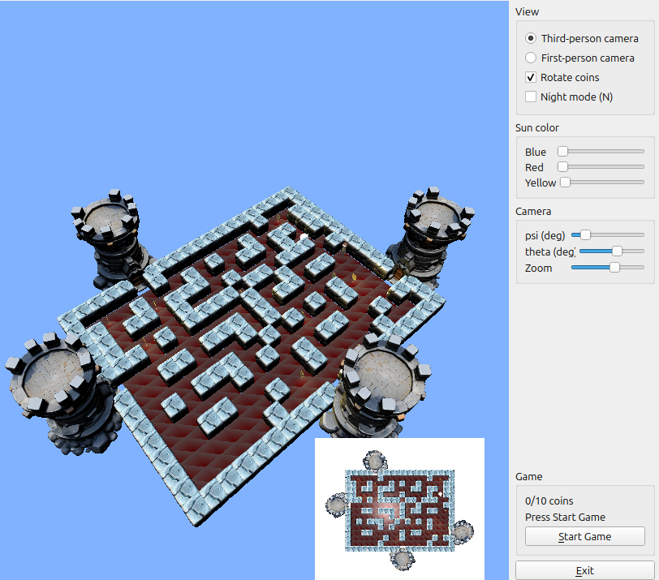
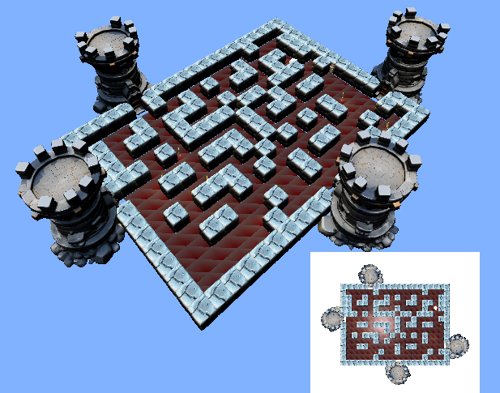
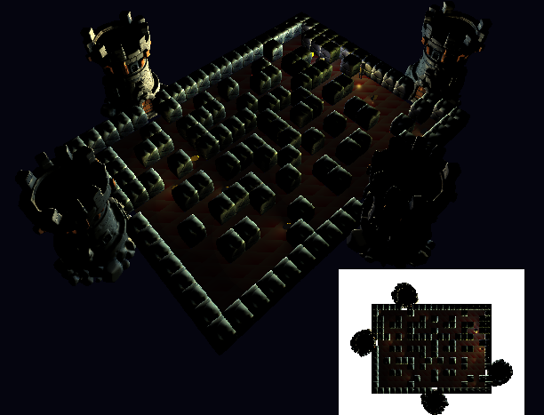

# Ghost in the Maze

**Ghost in the Maze** is a 3D maze game developed with **C++, Qt, and OpenGL**. The project focuses on real-time rendering, interactive camera control, shader-based lighting, textured 3D models, and a Qt-based user interface.

The player controls **Morty**, who is trapped inside a maze and must collect all the coins before reaching the exit. At the same time, an autonomous ghost moves through the maze and creates a constant threat, turning the gameplay into a race for survival.

For installation and build instructions, see [SETUP.md](SETUP.md).

## Screenshots

### Full view with UI

### Day view without UI

### Night view without UI

## Main Features

- Grid-based 3D maze built from a predefined map.
- Character movement with 90-degree rotation controls.
- Autonomous ghost movement with collision-based game over conditions.
- Collectible coins with animated rotation and a live collection counter.
- Exit towers placed at the maze exits.
- Multiple camera modes, including:
  - General third-person perspective
  - First-person view
  - Secondary orthographic overview
- Mouse and keyboard controls for camera rotation and zoom.
- Shader-based lighting with ambient, directional, point, and spotlight effects.
- Dynamic main light that simulates a sun moving across the scene.
- Night mode with a player flashlight and a ghost-mounted light.
- Coin-emitted lights that enhance the scene atmosphere.
- Textured 3D models loaded with Assimp.
- Qt interface for controlling camera, lighting, and gameplay options.

## Project Overview

This project combines real-time 3D graphics, gameplay logic, lighting techniques, camera systems, textures, and graphical user interfaces into a single interactive OpenGL application.